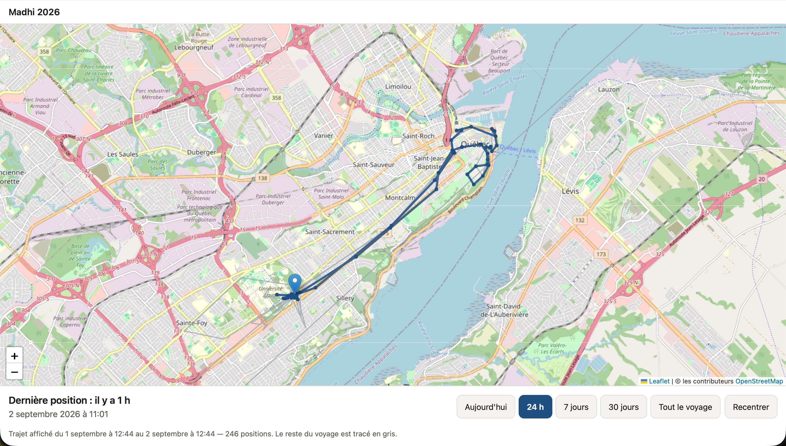

# Madhi Tracker

Suivi GPS d'un voyage à vélo de la France au Cap Nord, sur un an.

Un téléphone Android enregistre une position toutes les cinq minutes, la
garde en local, et l'envoie à un serveur privé dès qu'il y a du réseau. La
famille suit le trajet depuis un site web, derrière un lien secret et un mot
de passe.

Le critère de réussite du projet n'est pas technique :

> Peut-on donner ce téléphone à quelqu'un qui part un an à vélo et avoir
> confiance dans le fait que son trajet continuera d'être enregistré, sans
> intervention permanente ?

## État

| Brique | État |
|---|---|
| Application Android | 1.0.2 (`versionCode 4`), fonctionnellement complète, carte comprise, en attente de validation terrain |
| Serveur | Déployé sur `madhi-server.alexeber.fr`, en HTTPS, avec sauvegarde quotidienne et surveillance |
| Site familial | En ligne sur `madhi.alexeber.fr` depuis le 23 août 2026, derrière un segment d'URL secret et un mot de passe |
| Notice d'installation | `site/installer.html`, servie avec le site, autonome et sans requête sortante |

La chaîne est complète, du téléphone au site, et la procédure de départ est
écrite (`arch/20_depart.md`). Cela ne veut pas dire que le projet est prêt :
l'application n'a **pas encore** été validée en conditions réelles. Tant que
le protocole de `arch/14_protocole_test_terrain.md` n'est pas passé sur
l'appareil cible — le Redmi Note 11, pas le OnePlus de pré-validation — elle
repose sur une hypothèse. C'est le seul point bloquant du projet.

Un défaut précis est déjà connu et n'est pas corrigé : **l'application ne
repart pas toute seule après un redémarrage du téléphone.** Observé le 23 août
2026 sur OxygenOS, il a coûté vingt-quatre heures de suivi
(`arch/15_journal_tests_terrain.md`, session 5), et MIUI est plus hostile
encore. La consigne donnée en clair remplace le correctif : **après chaque
redémarrage, et après chaque mise à jour de l'APK, ouvrir l'application une
fois.** La piste ouverte depuis le 26 août est que le réglage « Démarrage auto
en arrière-plan » n'a jamais été appliqué au paquet `com.madhi.tracker` — le
défaut est peut-être une case à cocher plutôt qu'un bug.

## Ce que ça fait

**Sur le téléphone.** Une carte à l'ouverture, le trajet dessiné dessus, et
l'âge de la dernière position. Le tracé est bleu là où le serveur détient les
points, orange là où ils ne sont encore que sur le téléphone. Quatre périodes
— aujourd'hui, 24 h, 7 jours, tout le voyage — et le voyage entier reste
visible en bleu clair sous la période choisie, pour qu'un jour de vélo ne paraisse
jamais flotter dans le vide. Toucher un point du tracé dit quand on était là,
et où. Les réglages tiennent en deux choses, la cadence de capture (trois
valeurs courantes, plus « Autre ») et l'arrêt du suivi ; le diagnostic, qui
sera lu à voix haute au téléphone, est derrière un bouton.

La période « 24 h » existe parce qu'« aujourd'hui » ment la nuit : à une heure
du matin, la journée civile ne montre qu'une heure de trajet.

**Sur le site familial.** Le même écran, en plus court : la dernière position,
son ancienneté, le trajet de la période choisie — aujourd'hui, 24 h, 7 jours,
30 jours, tout le voyage — et une bulle au toucher d'un point. Le site
s'arrête à trente jours là où l'application va jusqu'au voyage entier : la
base est locale sur le téléphone, alors que le site dépend d'une réponse du
serveur.

**Ce que ni l'un ni l'autre ne fait.** Pas de temps réel, pas de statistiques,
pas de niveau de batterie, pas de vue publique. C'est `arch/06_site_V2.md`.

## Principes

**Hors ligne d'abord.** Une position est écrite en base locale avant toute
tentative réseau. Aucun chemin de code ne supprime un point non confirmé par
le serveur : ni un timeout, ni une erreur d'authentification, ni une réponse
illisible. Une tâche de vérification échouerait si le domaine se mettait à
dépendre d'Android.

**Idempotence par identifiant.** Chaque position reçoit un UUID à la capture.
Le serveur n'insère que les identifiants inconnus, et renvoie les autres
comme déjà détenus. Un envoi dont la réponse s'est perdue aboutit donc au
rejeu, sans créer de doublon.

**Pas de GAFAM sur le chemin des positions.** Ni Google Play Services, ni
Firebase, ni analytics, ni crash reporting externe. La localisation passe par
l'API système `LocationManager`, pas par Fused Location Provider. Aucune
coordonnée n'atteint les journaux techniques — la signature du port de
journalisation l'interdit par construction. Côté site, ce n'est plus une
discipline d'écriture mais une `Content-Security-Policy` : le navigateur
refuse tout hôte extérieur, tuiles exceptées.

**Personne ne parle au géocodeur à notre place.** L'adresse affichée dans la
bulle d'un point est demandée au serveur du voyage, qui relaie la question à
Nominatim, espace ses appels d'au moins une seconde et met les réponses en
cache. Ni le téléphone ni le navigateur de la famille ne contacte le
géocodeur. Le relais est désactivé par défaut, et le serveur refuse de
démarrer si on l'allume sans donner d'identité `User-Agent` joignable :
Nominatim est un bien commun.

**Réparable par une seule personne.** Un module Gradle, peu de dépendances,
aucune magie d'infrastructure. Le site n'a aucune étape de build : le fichier
du dépôt est exactement le fichier servi.

**Une carte qui marche sans réseau.** L'écran d'accueil dessine le trajet sur
un fond de tuiles raster, sans aucune bibliothèque cartographique. Le cache
disque est interrogé **avant** le réseau : une zone consultée une fois reste
lisible hors ligne, ce qui est le mode normal du voyage.

La source des tuiles est une configuration hors du dépôt, jamais du code : sans
elle la carte reste sur fond uni et n'émet aucune requête. Un fond
auto-hébergé, fabriqué par `tools/tiles` depuis des données du domaine public,
reste déployé en repli — c'est la seule source que le projet contrôle de bout
en bout (ADR-006, `arch/18`).

## Architecture

Hexagonale, avec des frontières logiques plutôt que des modules Gradle
séparés tant que la taille du projet ne le justifie pas.

    presentation/     Compose, ViewModels
    adapter/input/    service de premier plan, receveurs, worker
    application/      use cases et ports
    domain/           modèles et règles, sans Android
    adapter/output/   Room, DataStore, OkHttp, LocationManager, AlarmManager
    infrastructure/   racine de composition Hilt, configuration, journalisation

Le domaine et les use cases ne connaissent ni Android, ni Room, ni OkHttp.
La tâche Gradle `checkCoreIsFrameworkFree`, branchée sur `check`, échoue si
un import de framework s'y glisse.

## Construire

Prérequis : JDK 17 ou plus récent, SDK Android.

    ./gradlew assembleDebug        # APK de développement
    ./gradlew assembleRelease      # APK du voyage, signé et minifié par R8
    ./gradlew check                # tests et vérifications d'architecture

Les tests tournent sur la JVM, sans émulateur ni téléphone : Robolectric
couvre Room et DataStore, le reste s'appuie sur des doubles simples.

Le build release **échoue volontairement** si l'URL de l'API n'est pas
configurée, plutôt que de produire un APK pointant vers une valeur factice. Il
échoue aussi sans matériel de signature, pour ne pas livrer un APK signé avec la
clé de debug.

C'est le build release qui part en voyage (`arch/01` §2), donc c'est lui qui
doit passer les tests terrain : R8 supprime du code que le build debug conserve.

## Configuration

Aucune valeur réelle n'est versionnée. Copier les exemples :

    cp local.properties.example local.properties
    cp keystore.properties.example keystore.properties

Les variables d'environnement `MADHI_API_BASE_URL_*`,
`MADHI_UPDATE_PAGE_URL_*` et `ANDROID_SIGNING_*` ont la priorité sur ces
fichiers, ce qui évite d'avoir à les créer en CI.

## Publier une version

Le `versionCode` monte à chaque APK réellement installé : deux binaires
différents ne doivent jamais porter le même nom, sans quoi le `mapping.txt`
conservé ne se rattache plus à rien.

Chaque version publiée laisse trois fichiers, gardés hors du dépôt
(`dist/` est ignoré par git) :

    dist/<version>/madhi-tracker-<version>.apk    l'APK envoyé
    dist/<version>/mapping-<version>.txt          la table de renommage R8
    dist/<version>/SHA256SUMS                     l'empreinte de l'APK publié

**Conserver le `mapping.txt`** sous un nom qui porte la version, hors du
répertoire de build : R8 renomme tout, une pile d'appel remontée du voyage
sans lui est illisible, et un `./gradlew clean` l'efface sans prévenir.

L'APK est publié en *release* GitHub, sous son nom versionné et sous le nom
stable `madhi-tracker-latest.apk`, utilisé par `site/mise_a_jour.html`. La
notice d'installation peut pointer droit sur un fichier `.apk` précis — sur
Android le téléchargement part tout seul. L'empreinte affichée par la notice est
celle de l'APK **téléchargé puis recalculé**, pas celle d'une reconstruction
locale : deux builds du même code ne sont pas identiques octet pour octet, et
une empreinte qui ne correspond pas serait pire que pas d'empreinte du tout.

L'icône du lanceur est engendrée depuis `art/icone-source.jpeg` — une gravure
de Madhi — en trois calques (premier plan, fond, monochrome d'Android 13+) et
cinq densités. Le JPEG source est versionné parce que sans lui les densités ne
sont pas reconstructibles.

## Site familial

Le site que regarde la famille est dans `site/` : des fichiers statiques, sans
étape de build, servis par un conteneur nginx de la même stack que le serveur,
derrière un segment d'URL secret et un mot de passe. Il n'embarque aucun
secret — le token de lecture exigé par l'API est posé par le conteneur, et le
répertoire `site/` du dépôt est monté tel quel, sans copie intermédiaire.

    docker compose -f server/docker-compose.yml up -d   # la stack complete
    python3 tools/site-dev/serve.py            # le site seul, donnees fabriquees
    node tools/site-dev/verifier.mjs           # les verifications sans navigateur

`site/installer.html` y est déposée pour la même raison : le répertoire est
déjà monté, la notice sort donc sous le segment secret et derrière le mot de
passe familial — à savoir avant d'envoyer le lien à Madhi, qui n'a pas
forcément ce mot de passe.

Le déploiement sur `madhi.alexeber.fr` et les vérifications à faire ensuite
sont dans `site/README.md`.

## Serveur

FastAPI et PostgreSQL, en conteneurs, sur un VPS. Il reçoit les positions,
sert l'historique au site, et relaie le géocodage inverse. L'installation, les
variables d'environnement, la sauvegarde et le resserrement des droits sont
dans `SERVER_DEPLOYMENT.md`.

Une limite corrigée mérite d'être connue : l'historique n'est plus tronqué mais
**échantillonné**. La réponse plafonnait à dix mille points en coupant les plus
récents, donc au bout de trente-cinq jours de voyage le site aurait affiché une
dernière position figée, avec un statut vert (`arch/17` §4.1).

## Surveillance

Cinq sondes tournent sur le VPS tous les quarts d'heure — API, site, disque,
âge de la dernière sauvegarde, âge de la dernière position — et alertent sur le
téléphone. Elles existent parce qu'une panne silencieuse est la panne coûteuse :
le script de sauvegarde pouvait échouer trente jours d'affilée sans que
personne le sache.

Aucune alerte ne porte de coordonnée. La sonde de position lit `/status`, qui
ne renvoie que des horodatages, jamais `/latest-location`.

    sudo tools/monitoring/madhi-check.sh --dry-run
    sudo tools/monitoring/madhi-check.sh --test-alert

Deux certificats expirent pendant le voyage — `madhi-server.alexeber.fr` le
17 novembre 2026, `madhi.alexeber.fr` le 21 novembre. La surveillance ne
prévient pas à l'avance : elle passe au rouge le jour même. Le renouvellement
est donc à prouver avant novembre (`arch/20` §7).

Voir `tools/monitoring/README.md`, et `SERVER_DEPLOYMENT.md` pour la place de
cette surveillance dans l'exploitation.

## Serveur de simulation

Le serveur réel est déployé (voir `SERVER_DEPLOYMENT.md`) et les builds le
visent désormais. Le serveur de simulation reste utile pour travailler hors
ligne et sert de spécification exécutable de l'idempotence.

    python3 tools/mock-server/server.py

Voir `tools/mock-server/README.md`.

## Documentation

Les documents de `arch/` sont la source de vérité fonctionnelle. Les
décisions techniques prises en cours de route sont dans `arch/adr/`, au
format contexte / options / décision / conséquences.

Les plus utiles pour comprendre le projet :

- `arch/00_architecture_maitre.md` — contrats communs et règles d'évolution
- `arch/13_contrat_api_android_v1.md` — contrat API détaillé
- `arch/adr/002-execution-en-arriere-plan.md` — pourquoi un service de
  premier plan ne suffit pas, et ce qui le complète
- `arch/adr/007-contraintes-miui-redmi-note-11.md` — ce que la surcouche du
  téléphone cible impose
- `arch/adr/008-cadence-par-le-flux-de-localisation.md` — pourquoi la cadence
  est confiée au fournisseur de localisation
- `arch/14_protocole_test_terrain.md` — comment on prouve que ça marche
- `arch/15_journal_tests_terrain.md` — ce que chaque session sur l'appareil a
  montré, y compris ce qui a été perdu
- `arch/17_plan_implementation_site_poc.md` — plan d'exécution du site, et les
  pièges du serveur qu'il faut connaître avant de le construire
- `arch/18_carte_embarquee_v1.md` — comment la carte est faite, et comment on
  lui change son fond de tuiles
- `arch/20_depart.md` — la procédure du départ, dans l'ordre : serveur, APK,
  installation par Madhi, vérification, puis la date qui ouvre le voyage
- `site/README.md` — comment développer, déployer et vérifier le site familial
- `tools/monitoring/README.md` — ce qui est surveillé, ce qui ne l'est pas, et
  comment prouver que l'alerte arrive

## Licence

Pas encore déterminée.
